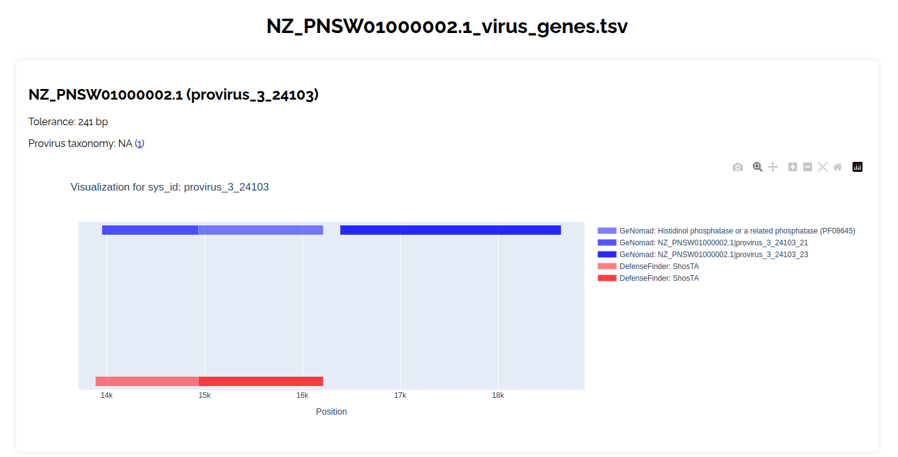

# Project Documentation

## Overview

This project is based on the analysis of prophage colocalization and defense systems in bacterial genomes, in order to better understand the defense mechanisms that bacteria develop against bacteriophages. Some of these phages carry genes encoding restriction or exclusion proteins, which prevent other phages from infecting the bacteria, thus providing a defense mechanism by blocking superinfection. In addition, some phages contain beneficial genes that enhance antibiotic resistance or environmental adaptation, helping bacteria to survive in hostile conditions.

Our aim is to develop a **ColocAtools** tool to analyze the colocalization of prophages and defense systems in bacterial genomes, in order to detect whether defense systems are provided by phages. The importance of this study lies in facilitating phage therapy, which uses phages (which do not develop defense systems) for treatments.

---

## Tools Used

For this, we will use three bioinformatics tools:

- **DefenseFinder**: Identifies anti-phage defense systems in bacterial genomes.
- **geNomad**: Searches for mobile elements (provirus, plasmid, etc.) that can be transferred between organisms.
- **PHASTEST**: Identifies and annotates prophages in bacterial genomes. PHASTEST offers an API that creates a waiting list, which may lead to delays in obtaining results, especially when the contigs are large or complex.

ColocAtools will then cross-check the results of these tools to provide a list of prophages and defense systems that overlap in the genome.

---

## Project Workflow

### 1. Installing the Dependencies

This tool relies on several bioinformatics dependencies that require specific versions, which may not be compatible with each other. To ensure proper installation and avoid conflicts, each tool will be installed in a separate Conda environment.

#### Prerequisites

Before starting the installation process, ensure the following prerequisites are met:
- Python 3 must be installed on your machine.

#### Installation Process

1. Run the `install.py` file:
   ```bash
   python3 install.py
   ```
   - The execution of the `install.py` file will activate a virtual environment and check if Conda is installed and accessible.
   - If Conda is not installed, the script should install it locally for you, but you will be asked to re-run `install.py` after rebooting your terminal.
   - The script will verify all required dependencies and create isolated Conda environments to install the necessary tools and libraries:
     - HMMER : version 3.4
     - DefenseFinder : version 2.2.0
     - geNomad : version 1.11.0-0
     - PHASTEST
     - jq
     - pandas, plotly, and ipywidgets
    - Three different conda environnements are then created : genomad, defense-finder and colocATool (the later is used to merge and visualise the results.)
   - After running this script, the terminal must be restarted to ensure that everything has been installed correctly.

### 2. Input Data

To run ColocAtools, it is necessary to provide a FASTA file of nucleotide sequences, as geNomad requires nucleotide sequences, while DefenseFinder can work with both nucleotide and proteomic sequences. Verification steps are included to ensure the file contains the right type of data.

Your files must contain the `.fa`, `.fasta` or `.fna` extension. It can be compressed `.gz` as it will be automatically gunzipped in a temporary directory.

### 3. Tool Pipeline

#### Prophage Detection with geNomad

After installing the necessary dependencies, the tool will run geNomad to search for prophages across the entire reference genome provided.

##### Output

- The results will be stored in the following directory:
  ```
  results/results_genomad/<genome_name_without_extension>
  ```
- The tool will focus on the file containing the constitutive genes of the different prophages and their genomic coordinates. This file is named:
  ```
  genome_name_virus_genes.tsv
  ```
- This file can be found in the `genome_name_summary` directory.

##### Documentation
For more information, refer to the official geNomad documentation:
[geNomad Documentation](https://portal.nersc.gov/genomad/pipeline.html)

#### Identification of Defense Systems with DefenseFinder

In this step, DefenseFinder is launched to detect all known anti-phage systems based on its pipeline.

##### Output

- The results from this step will be stored in the following directory:
  ```
  results/result_Finder/<genome_name_without_extension>
  ```
- The tool will then intersect the following files for further analysis:
  ```
  genome_name.fa_defense_finder_genes.tsv
  genome_name.fa.prt_defensefinder.prt
  ```

##### Documentation
For more information, refer to the official DefenseFinder documentation:
[DefenseFinder Documentation](https://github.com/mdmparis/defense-finder)

#### Prophage Identification with PHASTEST (optional)
If you want to include the execution of PHASTEST in your analysis, you must add the -p option when running the script. PHASTEST will identify and annotate prophages in the genome. Results:
##### Output

- The results from PHASTEST will be stored in the following directory: results/results_phastest/
##### Documentation
Documentation: For more information, refer to the official PHASTEST documentation:
https://phast.wishartlab.com


---

## Execution

To carry out the steps outlined above, execute the script `run.py`, which performs the colocalization analysis of defense systems and prophages in bacterial genomes:

```bash
python run.py [-h] [-f FILE] [-d DIRECTORY] [-t THREADS] [-p]
```

### Parameters

- `-f / --file <file>`: Specifies a `.fa` or `.fasta` file to analyze.
- `-d / --directory <directory>`: Specifies a directory with multiple files to analyze.
- `-t / --threads <number>`: Number of threads to use in geNomad (optional). By default, the threads will be set to 1.
- `-p / --phastest`: Include this option if you also want to run Phastest.

### Examples
```Bash
python run.py -f your/file.fna -t 4 -p 
```
Will run the analysis on the specified file with 4 threads for Genomad and will include the Phastest API request.

### Results

The results are stored in the following directories:

- `results/result_Finder/` - Contains the results corresponding to the processed input file.
- `results/results_genomad/` - Stores the results generated by geNomad.
- `results/results_phastest/` - Holds the results produced by Phastest.
- `results/final_results/` - Include merging outputs and a final report in `.html` format

#### Final results
Included in an html file, it includes plotly graphs based on the results of the two (or three if used the `-p` option).

##### Exemple output 


Note : Phastest results will always land on top, in green, Genomad is in blue and Defense Finder in red.

The legend contains the origin of the results (DF, Phastest or Genomad), and the name of the provirus gene and / or the defense mecanism.

The title is the name of file used in reference. It helps with identifying the file of origin.
---

## Notes

- Ensure that all dependencies are installed before executing the script.
- For large datasets, increasing the number of threads can improve performance.
- If analyzing multiple files, using the `--directory` option is recommended.

For further details, refer to the official documentation or contact the project maintainers.


## Example Usage

To illustrate the workflow, we provide a sample dataset and an example command to run the analysis.
### 1️⃣ Download an Example FASTA File
You can download a bacterial genome sequence directly from NCBI using:

```bash
wget -O NZ_PNSW01000002.1.fa "https://eutils.ncbi.nlm.nih.gov/entrez/eutils/efetch.fcgi?db=nuccore&id=NZ_PNSW01000002.1&rettype=fasta&retmode=text"
```
### 2️⃣ Run the Analysis:
After installing dependencies using install.py, execute the analysis with:

```
python run.py -f NZ_PNSW01000002.1.fa -t 4 -p
```

## References

- **DefenseFinder**: Developed by MDMP Team (Institut Pasteur).  
  Repository: [https://github.com/mdmparis/DefenseFinder](https://github.com/mdmparis/DefenseFinder)  
  Publication: 
  [- Tesson, F., Hervé, A., Mordret, E., Touchon, M., d’Humières, C., Cury, J., & Bernheim, A. (2022). *Systematic and quantitative view of the antiviral arsenal of prokaryotes*. Nature Communications.]  
  [- Néron, B., Denise, R., Coluzzi, C., Touchon, M., Rocha, E. P. C., & Abby, S. S. (2023). *MacSyFinder v2: Improved modelling and search engine to identify molecular systems in genomes*. Peer Community Journal, 3, e28.]
  [  - Couvin, D., et al. (2018). *CRISPRCasFinder, an update of CRISRFinder, includes a portable version, enhanced performance and integrates search for Cas proteins*. Nucleic Acids Research.] 

- **geNomad**: Developed by PhiWeber Lab.  
  Repository: [https://github.com/phiweger/geNomad](https://github.com/phiweger/geNomad)  
  Publication: [  - Camargo, A. P., Roux, S., Schulz, F., Babinski, M., Xu, Y., Hu, B., Chain, P. S. G., Nayfach, S., & Kyrpides, N. C. (2023). *Identification of mobile genetic elements with geNomad*. Nature Biotechnology. DOI: [10.1038/s41587-023-01953-y](https://doi.org/10.1038/s41587-023-01953-y)]  

- **PHASTEST**: Developed by PhageParser Team.  
  Repository: [https://github.com/phageParser/PHASTEST](https://github.com/phageParser/PHASTEST)  
  Publication: [ - Wishart, D. S., Han, S., Saha, S., Oler, E., Peters, H., Grant, J., Stothard, P., & Gautam, V. (2023). *PHASTEST: Faster than PHASTER, Better than PHAST*. Nucleic Acids Research (Web Server Issue). DOI: [10.1093/nar/gkad382](https://doi.org/10.1093/nar/gkad382)]  
